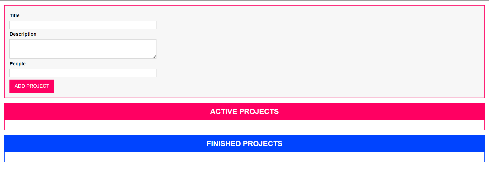
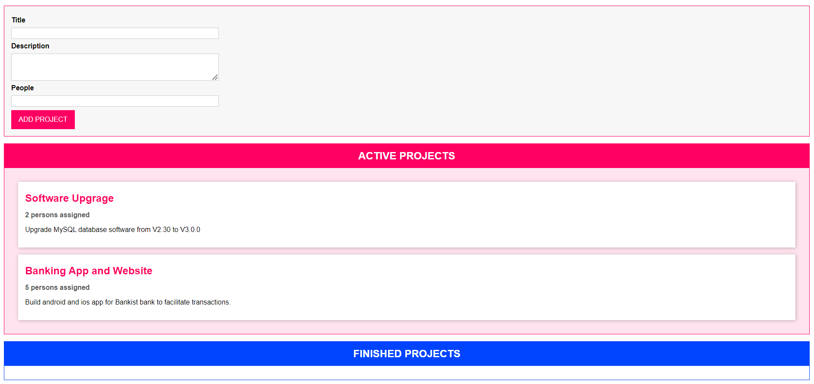
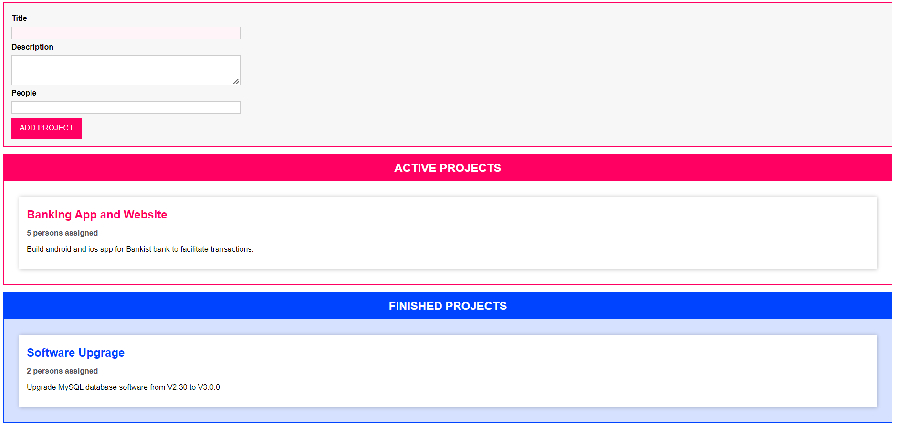

# ProjectManager

ProjectManager is a simple web application for managing projects. It allows users to input project details such as title, description, and number of people assigned to the project. Projects can be categorized as either active or finished, and users can drag and drop projects between these categories.

## Features

- Add new projects with title, description, and number of people assigned.
- View active and finished projects separately.
- Drag and drop projects between active and finished categories.
- Input validation for project details.
- Responsive design for various screen sizes.

## Technologies Used

- HTML5
- CSS3
- Typescript / JavaScript (ES6+)

## How to Use

1. Clone the repository.
2. Open the `index.html` file in a web browser.

## Screenshots

## Development

To contribute to the development of ProjectManager, follow these steps:

1. Fork the repository.
2. Clone your forked repository to your local machine.
3. Make changes to the codebase.
4. Test your changes thoroughly.
5. Commit your changes and push them to your fork.
6. Submit a pull request to the main repository.
